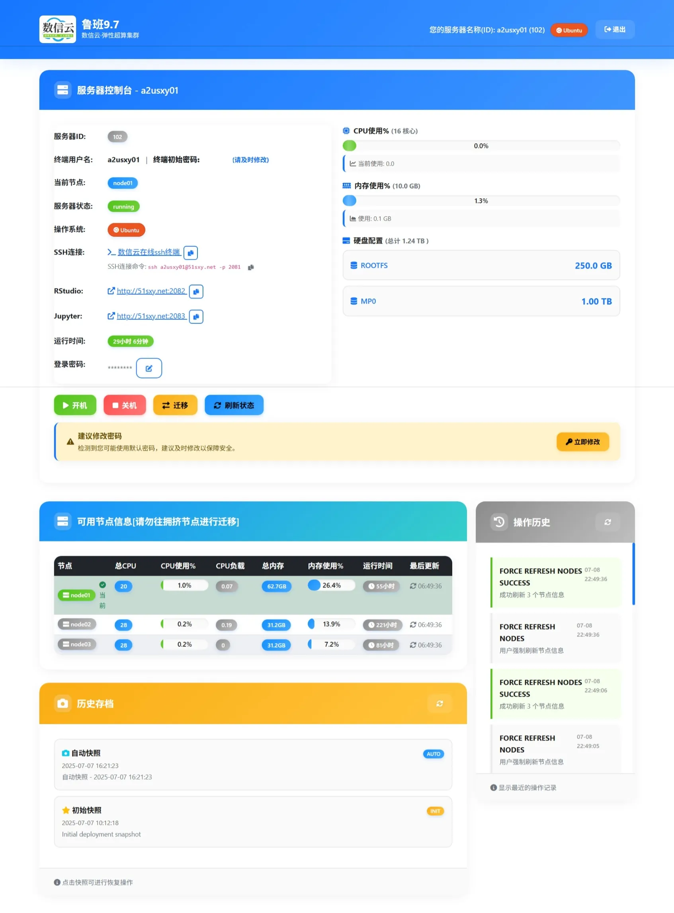
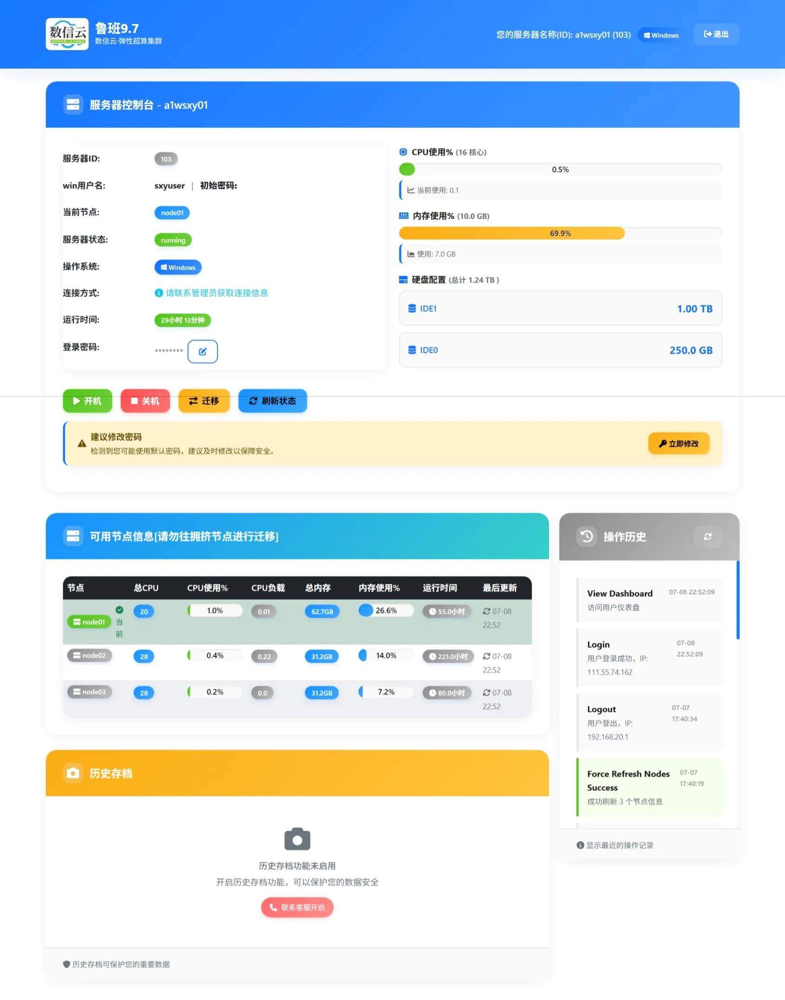

## 用户控制台介绍

登录后，界面如下：

注意：[鲁班9.7]的登录密码 和 终端的用户密码 各自独立，登录终端后才能修改终端的用户密码！

##### Linux系统

##### Windows系统

### 使用

在用户控制台中，可以查看服务器用户名、初始密码、CPU使用、内存使用、磁盘大小以及节点使用情况，历史记录会显示以往的操作记录，并且可以查看异常的IP登录信息。

在用户控制台中，用户可以自主进行开机、关机、节点迁移、密码修改、数据历史存档恢复等操作。
