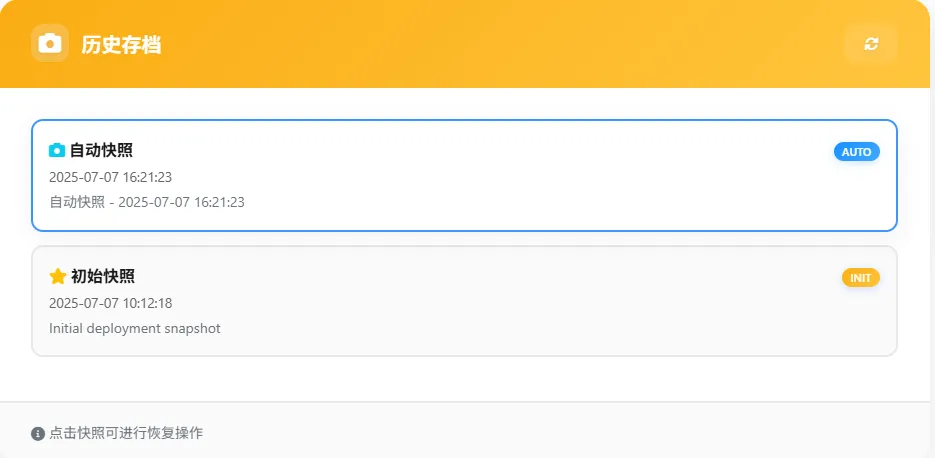
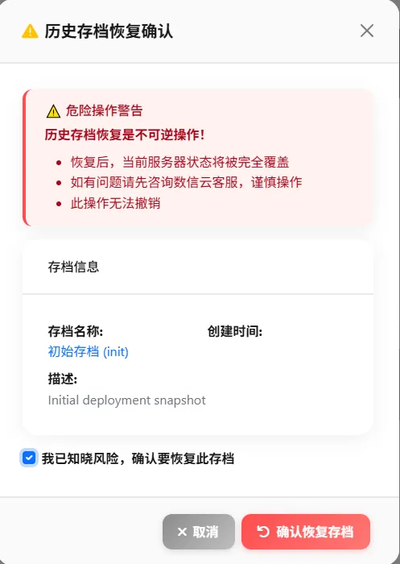

### 数据历史存档功能

**目前[历史存档]属于付费功能，可联系客服购买服务。**

首先，在创建账号时，即会产生一个初始存档点(相当于新手村的出生点)，可以用于恢复系统的初始状态。

若购买并开启了[历史存档]服务，您的服务器将在每天凌晨3点自动产生一个新存档点(相当于走出新手村后的某个存档点)，并保留48小时。

**历史存档恢复：**

若您需要回到某一个存档点，可以进行恢复操作。

**例子：**

**您已经购买并开启了[历史存档]服务，您今天下午误删一个脚本，则您可以将服务器的状态恢复回昨天凌晨3点的状态。**

使用时选择快照，先勾选“我已知晓风险，确认要恢复此存档”，然后点击“确认恢复此存档”，然后等待恢复完成。

